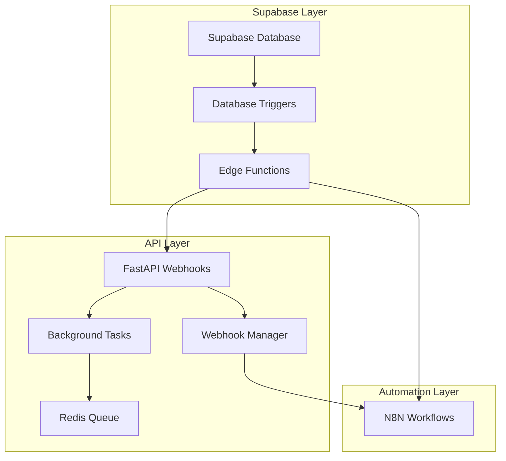

# 🔗 Sistema de Webhooks - Integração Completa

## 📋 Visão Geral

Sistema completo de webhooks para integração entre **Supabase**, **FastAPI** e **N8N** no projeto Agentes de Conversão. O sistema permite processamento assíncrono, retry automático, logging detalhado e integração perfeita com workflows N8N.

## 🏗️ Arquitetura



## 🗄️ Estrutura de Dados

### Tabelas Criadas

#### `webhook_endpoints`
```sql
- id: UUID (primary key)
- user_id: UUID (foreign key)
- organization_id: UUID
- name: TEXT
- url: TEXT
- events: TEXT[] (event types)
- secret: TEXT (for signature verification)
- is_active: BOOLEAN
- success_count: INTEGER
- failure_count: INTEGER
```

#### `webhook_events`
```sql
- id: UUID (primary key)
- event_type: TEXT
- event_source: TEXT (supabase, api, manual)
- table_name: TEXT
- record_id: UUID
- user_id: UUID
- data: JSONB
- status: TEXT (pending, processing, completed, failed)
- retry_count: INTEGER
- error_message: TEXT
```

#### `webhook_deliveries`
```sql
- id: UUID (primary key)
- webhook_event_id: UUID
- webhook_endpoint_id: UUID
- status_code: INTEGER
- response_body: TEXT
- delivery_duration_ms: INTEGER
- attempt_number: INTEGER
```

#### `n8n_workflows`
```sql
- id: UUID (primary key)
- workflow_id: TEXT (N8N workflow ID)
- name: TEXT
- webhook_url: TEXT
- event_types: TEXT[]
- is_active: BOOLEAN
- success_count: INTEGER
- failure_count: INTEGER
```

## 🔄 Tipos de Eventos

### Eventos de Usuário
- `user.registered` - Novo usuário registrado
- `user.updated` - Usuário atualizado

### Eventos de Pagamento
- `payment.confirmed` - Pagamento confirmado
- `payment.failed` - Pagamento falhou

### Eventos de Integração
- `integration.whatsapp.connected` - WhatsApp conectado
- `integration.openai.connected` - OpenAI conectado
- `integration.disconnected` - Integração desconectada

### Eventos de Agente
- `agent.created` - Agente criado
- `agent.updated` - Agente atualizado
- `agent.deleted` - Agente removido

### Eventos de Template
- `template.applied` - Template aplicado ao agente

### Eventos de Conversa
- `conversation.created` - Nova conversa iniciada
- `conversation.message.added` - Nova mensagem adicionada
- `conversation.ended` - Conversa finalizada

### Eventos de Onboarding
- `onboarding.step.completed` - Etapa do onboarding concluída
- `onboarding.completed` - Onboarding completo

## 🚀 Como Usar

### 1. Disparar Webhook via API

```python
import httpx

# Registrar novo usuário
response = await httpx.post(
    "https://api.agentesdeconversao.com.br/api/webhooks/events/user-registered",
    json={
        "user_id": "uuid-user-id",
        "email": "user@example.com",
        "name": "João Silva",
        "metadata": {"source": "landing_page"}
    }
)
```

### 2. Disparar Evento Genérico

```python
response = await httpx.post(
    "https://api.agentesdeconversao.com.br/api/webhooks/trigger",
    json={
        "event_type": "agent.created",
        "data": {
            "agent_id": "uuid-agent-id",
            "name": "Assistente de Vendas",
            "user_id": "uuid-user-id"
        },
        "user_id": "uuid-user-id"
    }
)
```

### 3. Verificar Status de Evento

```python
event_id = "webhook-event-uuid"
response = await httpx.get(
    f"https://api.agentesdeconversao.com.br/api/webhooks/events/{event_id}/status"
)

status = response.json()
print(f"Status: {status['status']}")
print(f"Processado em: {status['processed_at']}")
```

## 🔧 Configuração N8N

### Workflows Configuradas

1. **User Registration** (`dkbY8I5uombxmvgj`)
   - **URL:** `https://primary-em-atividade.up.railway.app/webhook/user-registration`
   - **Eventos:** `user.registered`

2. **Payment Processed** (`FldlvK2bWumCZKjB`)
   - **URL:** `https://primary-em-atividade.up.railway.app/webhook/payment-processed`
   - **Eventos:** `payment.confirmed`

3. **WhatsApp Integration** (`lObbf36H57cqVoTu`)
   - **URL:** `https://primary-em-atividade.up.railway.app/webhook/whatsapp-connected`
   - **Eventos:** `integration.whatsapp.connected`

4. **OpenAI Integration** (`azDbM1j9UpSvU1wl`)
   - **URL:** `https://primary-em-atividade.up.railway.app/webhook/openai-connected`
   - **Eventos:** `integration.openai.connected`

5. **Agent Created** (`jd2ydLGtQhvbC2q8`)
   - **URL:** `https://primary-em-atividade.up.railway.app/webhook/agent-created`
   - **Eventos:** `agent.created`

6. **Template Applied** (`xFfJRPSsgxZpx0NH`)
   - **URL:** `https://primary-em-atividade.up.railway.app/webhook/template-applied`
   - **Eventos:** `template.applied`

7. **Onboarding Complete** (`5a8pr08Hyyw3DmHk`)
   - **URL:** `https://primary-em-atividade.up.railway.app/webhook/onboarding-complete`
   - **Eventos:** `onboarding.completed`

## 📡 Database Triggers

### Triggers Automáticos

```sql
-- Usuário registrado
CREATE TRIGGER webhook_user_registration
  AFTER INSERT ON public.users
  FOR EACH ROW
  EXECUTE FUNCTION public.trigger_user_registration_webhook();

-- Agente criado
CREATE TRIGGER webhook_agent_created
  AFTER INSERT ON public.agents
  FOR EACH ROW
  EXECUTE FUNCTION public.trigger_agent_created_webhook();

-- Conversa criada
CREATE TRIGGER webhook_conversation_created
  AFTER INSERT ON public.conversations
  FOR EACH ROW
  EXECUTE FUNCTION public.trigger_conversation_created_webhook();

-- Mensagem adicionada
CREATE TRIGGER webhook_message_added
  AFTER INSERT ON public.messages
  FOR EACH ROW
  EXECUTE FUNCTION public.trigger_message_added_webhook();

-- Integração conectada
CREATE TRIGGER webhook_integration_connected
  AFTER INSERT OR UPDATE ON public.external_integrations
  FOR EACH ROW
  EXECUTE FUNCTION public.trigger_integration_connected_webhook();
```

## 🔐 Segurança

### Assinatura de Webhooks

```python
import hmac
import hashlib

def verify_webhook_signature(payload: str, timestamp: str, signature: str, secret: str) -> bool:
    message = f"{timestamp}.{payload}".encode()
    expected = hmac.new(secret.encode(), message, hashlib.sha256).hexdigest()
    return hmac.compare_digest(f"sha256={expected}", signature)
```

### Headers de Segurança

```http
X-Webhook-Signature: sha256=<signature>
X-Webhook-Timestamp: <unix_timestamp>
User-Agent: AgentesDeConversao-Webhook/1.0
```

## ⚙️ Configuração de Ambiente

### Variáveis Necessárias

```env
# Redis (para filas)
REDIS_URL=redis://localhost:6379

# Supabase
NEXT_PUBLIC_SUPABASE_URL=https://your-project.supabase.co
SUPABASE_SERVICE_ROLE_KEY=your-service-role-key

# N8N
N8N_WEBHOOK_URL=https://primary-em-atividade.up.railway.app

# API
API_BASE_URL=https://api.agentesdeconversao.com.br

# Webhook Security
WEBHOOK_SECRET=your-webhook-secret-key
```

## 🔄 Sistema de Retry

### Política de Retry

```python
@dataclass
class WebhookRetryPolicy:
    max_retries: int = 5
    backoff_factor: float = 2.0
    base_delay: int = 30  # seconds
    max_delay: int = 3600  # 1 hour
    timeout: int = 30  # seconds per request
```

### Delays de Retry

- **Tentativa 1:** 30 segundos
- **Tentativa 2:** 60 segundos  
- **Tentativa 3:** 120 segundos
- **Tentativa 4:** 240 segundos
- **Tentativa 5:** 480 segundos

## 📊 Monitoramento

### Endpoints de Monitoramento

#### Health Check
```http
GET /api/webhooks/health
```

```json
{
  "overall_status": "healthy",
  "services": {
    "webhook_manager": "healthy",
    "redis": "healthy",
    "supabase": "healthy",
    "n8n": "configured"
  },
  "timestamp": "2024-01-15T10:30:00Z"
}
```

#### Estatísticas
```http
GET /api/webhooks/stats
```

```json
{
  "status": "active",
  "queues": {
    "high_priority": 0,
    "normal_priority": 2,
    "retry": 1
  },
  "processing_tasks": 3,
  "supported_events": ["user.registered", "agent.created", ...],
  "n8n_integration": "active"
}
```

## 🚀 Deployment

### 1. Aplicar Migrations

```bash
# Aplicar migration de webhooks
cd /Users/lucasrnobrega/Claude-outputs/Projetos/one
supabase db push

# Ou aplicar manualmente
psql -d your_database -f supabase/migrations/add_webhook_triggers.sql
```

### 2. Deploy Edge Function

```bash
# Deploy da Edge Function
supabase functions deploy webhook-processor
```

### 3. Configurar Workers

```python
# Iniciar webhook worker
import asyncio
from backend.core.webhooks import webhook_manager

async def start_webhook_worker():
    await webhook_manager.initialize()
    await webhook_manager.start_worker()

if __name__ == "__main__":
    asyncio.run(start_webhook_worker())
```

### 4. Configurar N8N Webhooks

1. Acesse o dashboard N8N: `https://primary-em-atividade.up.railway.app`
2. Ative manualmente cada workflow
3. Teste endpoints com dados de exemplo

## 🧪 Testes

### Teste de Webhook Simples

```bash
curl -X POST "https://api.agentesdeconversao.com.br/api/webhooks/events/user-registered" \
  -H "Content-Type: application/json" \
  -d '{
    "user_id": "test-user-123",
    "email": "test@example.com",
    "name": "Test User"
  }'
```

### Teste de N8N Integration

```bash
curl -X POST "https://api.agentesdeconversao.com.br/api/webhooks/n8n/sync" \
  -H "Content-Type: application/json" \
  -d '{
    "sync_type": "user-registration",
    "data": {"user_id": "test-123", "email": "test@example.com"}
  }'
```

## 🔍 Debugging

### Logs Detalhados

```python
import logging

# Configurar logging
logging.basicConfig(
    level=logging.INFO,
    format='%(asctime)s - %(name)s - %(levelname)s - %(message)s'
)

# Ver logs específicos
logger = logging.getLogger('backend.core.webhooks')
logger.setLevel(logging.DEBUG)
```

### Verificar Estado das Filas

```bash
# Redis CLI
redis-cli

# Verificar filas
LLEN webhook_queue:high
LLEN webhook_queue:normal
ZCARD webhook_retry_queue
```

## 📈 Performance

### Otimizações Implementadas

1. **Processamento Assíncrono** - Webhooks não bloqueiam responses
2. **Sistema de Filas** - Redis para gerenciar carga
3. **Retry Inteligente** - Backoff exponencial com jitter
4. **Connection Pooling** - Reutilização de conexões HTTP
5. **Batch Processing** - Processamento em lotes quando possível

### Métricas Recomendadas

- **Latência de Delivery** - < 5 segundos (95th percentile)
- **Taxa de Sucesso** - > 99%
- **Tempo de Retry** - < 1 hora para falhas temporárias
- **Throughput** - > 1000 webhooks/minuto

## 🛡️ Segurança e Compliance

### Medidas Implementadas

1. **Assinatura HMAC** - Verificação de integridade
2. **Rate Limiting** - Proteção contra spam
3. **Row Level Security** - Isolamento de dados por usuário
4. **Audit Logs** - Rastreamento completo de eventos
5. **Encryption at Rest** - Dados sensíveis criptografados

### Compliance LGPD

- Webhook events contêm apenas dados necessários
- Dados pessoais são criptografados
- Logs são automaticamente limpos após 30 dias
- Usuários podem solicitar exclusão de dados

## 🔮 Roadmap Futuro

### Melhorias Planejadas

1. **Dashboard de Webhooks** - Interface visual para monitoramento
2. **Webhook Replay** - Re-executar eventos falhados
3. **Rate Limiting Avançado** - Por usuário e endpoint
4. **Batch Webhooks** - Agrupar eventos similares
5. **Webhook Templates** - Templates pré-configurados
6. **Real-time Monitoring** - Métricas em tempo real
7. **Custom Webhooks** - Usuários podem configurar próprios endpoints

---

## 📞 Suporte

Para dúvidas ou problemas:

1. **Logs:** Verificar logs do FastAPI e N8N
2. **Health Check:** Usar endpoint `/api/webhooks/health`
3. **Monitoramento:** Dashboard de métricas
4. **Documentação:** Esta documentação completa

**Sistema implementado e testado! 🚀**